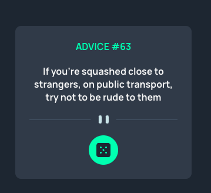

# Frontend Mentor Project - Advice generator app

This project was an assignment from my accountability partner [Smug](https://github.com/theadusamuel) to deepen my understanding of useEffects hooks in react. The project is a solution to the [Advice generator app challenge on Frontend Mentor](https://www.frontendmentor.io/challenges/advice-generator-app-QdUG-13db).

The challenge was to build out this advice generator app using the [Advice Slip API](https://api.adviceslip.com) and get it looking as close to the design as possible.

## Table of contents

- [Overview](#overview)
  - [The challenge](#the-challenge)
  - [Screenshot](#screenshot)
  - [Links](#links)
- [My process](#my-process)
  - [Built with](#built-with)
  - [What i learned](#what-i-learned)
  - [Available scripts](#available-scripts)
  - [Useful resources](#useful-resources)
- [Author](#author)
- [Acknowledgments](#acknowledgments)

## Overview

### The challenge

Users should be able to:

- View the optimal layout for the site depending on their device's screen size
- Student should be able to use and understand the intricacies of using useEffect & useState hooks in react

### Screenshot



### Links

- [advice-generator](https://advice-generator-app-tau-dun.vercel.app/)

### Built with

- Semantic HTML5 markup
- CSS custom properties
- Flexbox
- Mobile-first workflow
- React

### What I learned

This particular project helped me go back the basics of setting up a react app, using props, & staying consistent with the mobile first work flow, as well as using semantic HTML.

In this particular project, I learnt that using useEffect hook, I had to employ the useState hooks: (i) To save the API data call into state, (ii) As well as, figuring out that when i want to use the API data in my app, I have to reference that data using another state hook, as demonstrated in this project.

I also learned about box shadows syntax properly & writing it accordingly.

box-shadow: h-offset v-offset blur spread color;

h-offset: Horizontal offset of the shadow. A positive value puts the shadow on the right side of the box, a negative value puts the shadow on the left side of the box - Required

v-offset: Vertical offset of the shadow. A positive value puts the shadow below the box, a negative value puts the shadow above the box - Required

blur: Blur radius (The higher the number, the more blurred the shadow will be) - Optional

color: Color of the shadow - Optional

spread: Spread radius. A positive value increases the size of the shadow, a negative value decreases the size of the shadow - Optional

inset: Changes the shadow from an outer shadow to an inner shadow - Optional

```css
.btn {
	background-color: var(--clr-neongreen);
	border: none;
	width: 50px;
	height: 50px;
	border-radius: 60%;
	position: relative;
	margin-top: 20px;
	transition: all 0.5s ease-in-out;
}

.btn:hover {
	cursor: pointer;
	color: var(--clr-neongreen);
	box-shadow: 0px 0px 30px 8px var(--clr-neongreen);
}
```

### Available Scripts

This project was bootstrapped with [Create React App](https://github.com/facebook/create-react-app).

In the project directory, you can run:

### `npm start`

Runs the app in the development mode.\
Open [http://localhost:3000](http://localhost:3000) to view it in your browser.

### Useful resources

- [Scrimba](https://scrimba.com/learn/learnreact) - This platform provided me with an opportunity to learn react for free.

- [source of the above explanation about box shadows ](https://stackoverflow.com/questions/5608222/how-to-apply-box-shadow-on-all-four-sides)

## Author

- Github - [@soji](https://github.com/soji-opa)

## Acknowledgments

I am very grateful to [Smug](https://github.com/theadusamuel) & [Openwell](https://github.com/openwell) for always making time out of their busy schedules to see to my coding challenges and providing me with extra motivation.
